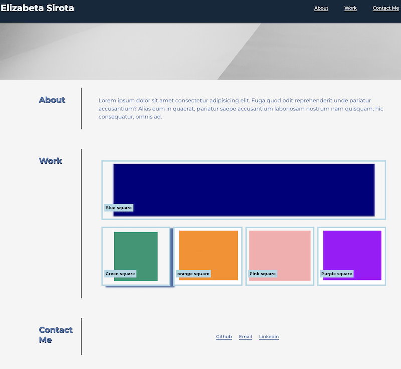

<!DOCTYPE html>
<html lang="en">
<head>
    <meta charset="UTF-8">
    <meta http-equiv="X-UA-Compatible" content="IE=edge">
    <meta name="viewport" content="width=device-width, initial-scale=1.0">
    <title>Professional Readme Generator</title>
</head>
<body>
    <header>
        <h1>lwdlqwd</h1>
        
 
            <h2> Table of Contents </h2>
            <ul>
            <li><a href="#description">Description</a></li>
            <li><a href="#installation">installation</a></li>
            <li><a href="#usage">Usage</a></li>
            <li><a href="#license">license</a></li>
            <li><a href="#contributing">Contributing</a></li>
            <li><a href="#tests">Tests</a></li>
            <li><a href="#questions">Questions</a></li>
            </ul>
        

    </header>
    <main>
        <section id="description">
            <h2>Description</h2>
            
qllwqdlqwd\

        </section>
        <section id="installation">
            <h2>Installation</h2>
            
nwldmqlw

        </section>
        <section id="usage">
            <h2>Usage</h2>
            
nwldwq

            
        </section>
        <section id="license">
        <h2>license</h2>
        
kwmdw

    </section>
        <section id="contributing">
            <h2>Contributing</h2>
            
dlqwmd;

        </section>
        <section id="tests">
            <h2>Tests</h2>
            
dnlwdmw

        </section>
        <section id="questions">
            <h2>Questions</h2>
            
ndwldmw

        </section>
    </main> 
</body>
</html>