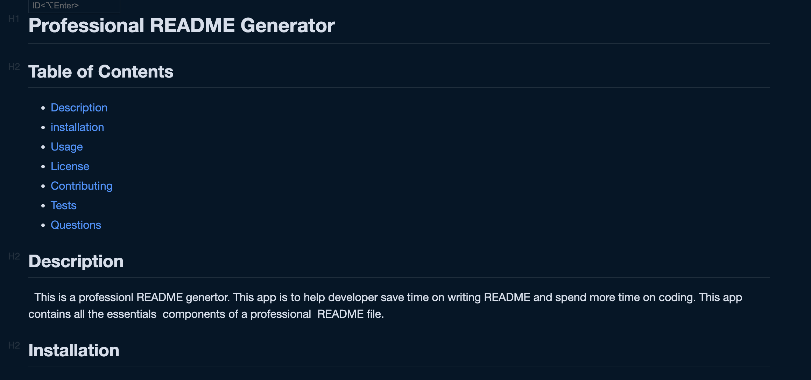

  # Porfessional README Generator
  
  ## Table of Contents
            
  - [Description](#description)
  - [installation](#installation)
  - [Usage](#usage)
  - [License](#license)
  - [Contributing](#contributing)
  - [Tests](#tests)
  - [Questions](#questions)
      
 
  ## Description
  This is a professional README generator. This app was created to help developers save time on creating README file and spend more time on coding. This file contains all the components of a professional README file. 
  
  ## Installation
  You need to install node.js, inquirer and fs libraries

  ## Usage
  The questions will appear in your terminal. Open the terminal and answer the presented questions. Dont forget to add correctly the  imagePath , username on GithHub, and Email adrress. 
  
    
  ## License
   

  ## Contributing
  
 
  ## Tests
  
 
  ## Questions
  
  [The URL of the GitHub profile](https://github.com/lizaS2022).
  For additional questions, dont hesitate to contact me at elizabetasirota@gmail.com.
